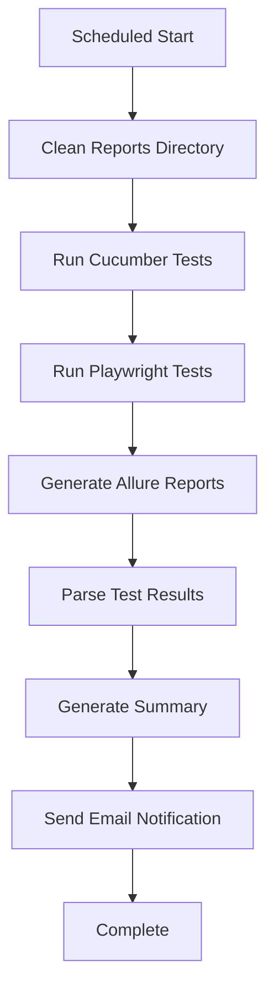

# 🌙 ParaBank Automated Test System Setup Guide

## 📋 Prerequisites

1. **Node.js** (v16 or higher)
2. **Gmail Account** with App Password enabled
3. **VS Code** (recommended)

## 🔧 Initial Setup

### 1. Environment Configuration

Copy the example environment file:
```bash
cp .env.example .env
```

Edit `.env` file with your credentials:
```env
EMAIL_HOST=smtp.gmail.com
EMAIL_PORT=587
EMAIL_USER=your-email@gmail.com
EMAIL_PASS=your-gmail-app-password
RECIPIENT_EMAIL=vmurashev@gmail.com
```

### 2. Gmail App Password Setup

1. Go to Google Account settings
2. Enable 2-Factor Authentication
3. Generate App Password:
   - Search "App passwords" in settings
   - Select "Mail" and your device
   - Copy the 16-character password to `EMAIL_PASS` in `.env`

### 3. Install Dependencies

```bash
npm install
```

## 🚀 Usage Commands

### Start Nightly Scheduler
```bash
npm run automation:start
```
- Runs tests daily at 2:00 AM Moscow Time
- Sends results to `vmurashev@gmail.com`
- Press `Ctrl+C` to stop

### Run Tests Immediately
```bash
npm run automation:run
```
- Executes full test suite
- Generates Allure reports
- Sends email notification
- Exits after completion

### Test the System
```bash
npm run automation:test
```
- Schedules test execution in 5 seconds
- Perfect for testing email notifications
- Validates complete pipeline

### Check Status
```bash
npm run automation:status
```
- Shows if scheduler is running
- Displays next scheduled run time

## 📊 Test Execution Flow



## 📧 Email Notification Features

### ✅ Success Email Includes:
- Executive summary with success rate
- Detailed test statistics
- Performance analysis
- Links to HTML reports
- Colorful charts and graphs

### ❌ Failure Email Includes:
- Error details and stack traces
- System information
- Immediate notification for quick response

## 🗂️ Generated Reports

After each run, you'll find:
```
reports/
├── allure-results/          # Raw test data
├── allure-report/          # Interactive HTML report
├── cucumber-report.html    # Cucumber HTML report
├── SUMMARY.md             # Markdown summary
└── screenshots/           # Failure screenshots
```

## 🕐 Scheduling Options

### Default Schedule
- **Time**: 2:00 AM Moscow Time
- **Frequency**: Daily
- **Timezone**: Europe/Moscow

### Custom Schedule
Set `CRON_SCHEDULE` in `.env`:
```env
# Every 6 hours
CRON_SCHEDULE=0 */6 * * *

# Weekdays at 8 AM
CRON_SCHEDULE=0 8 * * 1-5

# Every Sunday at midnight
CRON_SCHEDULE=0 0 * * 0
```

## 🔍 Monitoring & Logs

### Console Output
```bash
🚀 ParaBank Automated Test System v3.0
✅ Environment configuration validated
📧 Email notifications will be sent to: vmurashev@gmail.com
🌙 Starting nightly test scheduler...
🕐 Scheduler active - tests will run daily at 2:00 AM Moscow Time
```

### Log Files
- System logs are displayed in console
- Email delivery confirmations
- Test execution status updates

## 🛠️ Troubleshooting

### Common Issues

#### 1. Email Authentication Failure
```
Error: Invalid login: 535-5.7.8 Username and Password not accepted
```
**Solution**: Verify Gmail App Password is correct

#### 2. Missing Environment Variables
```
❌ Missing required environment variables: EMAIL_USER, EMAIL_PASS
```
**Solution**: Check `.env` file configuration

#### 3. Test Execution Timeout
```
❌ Cucumber execution error: timeout
```
**Solution**: Tests have 30-second timeouts; check network connection

## 🔒 Security Best Practices

1. **Never commit `.env` file** to version control
2. **Use App Passwords** instead of main Gmail password
3. **Restrict email access** to trusted recipients only
4. **Monitor logs** for unauthorized access attempts

## 📈 Performance Optimization

### System Requirements
- **RAM**: 4GB minimum, 8GB recommended
- **CPU**: Multi-core processor for parallel execution
- **Storage**: 2GB free space for reports and logs

### Optimization Tips
- Run during off-peak hours (2:00 AM default)
- Use SSD storage for faster report generation
- Monitor CPU usage during execution

## 🆘 Support & Maintenance

### Daily Monitoring
- Check email delivery success
- Monitor test success rates
- Review failure patterns

### Weekly Maintenance
- Clean old report files
- Update dependencies
- Review email logs

### Monthly Tasks
- Rotate App Passwords
- Update test scenarios
- Performance analysis

## 📞 Contact Information

For issues or questions:
- **Email**: vmurashev@gmail.com
- **System**: ParaBank Unified Test Framework v3.0
- **Repository**: GitHub (link in package.json)

---
*Last updated: ${new Date().toLocaleDateString()}*
